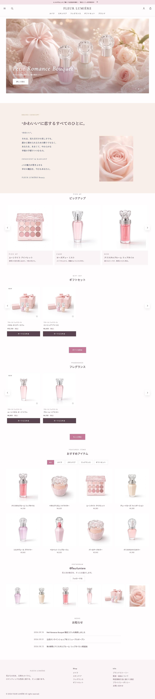
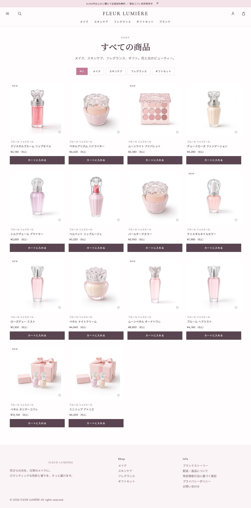
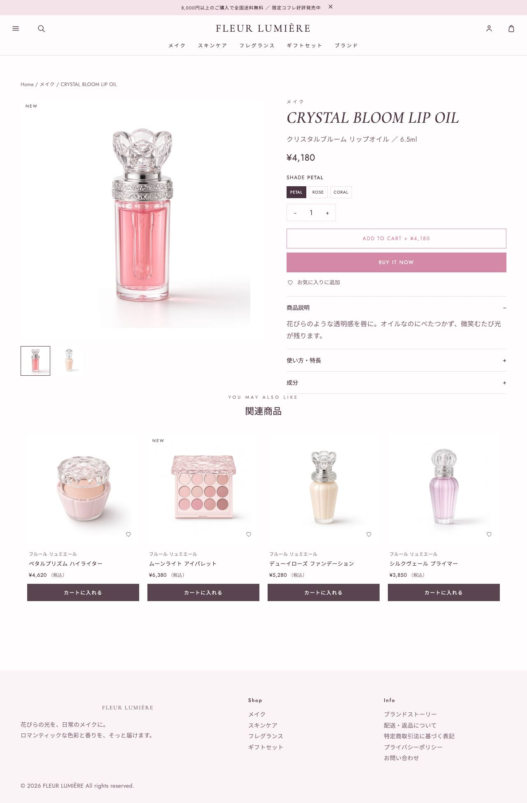
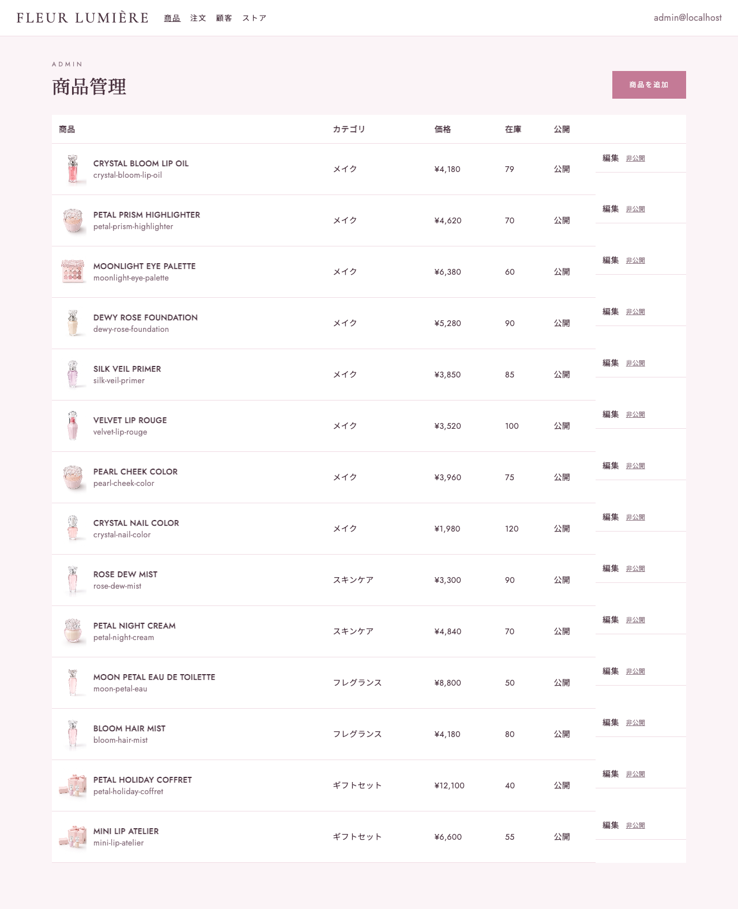
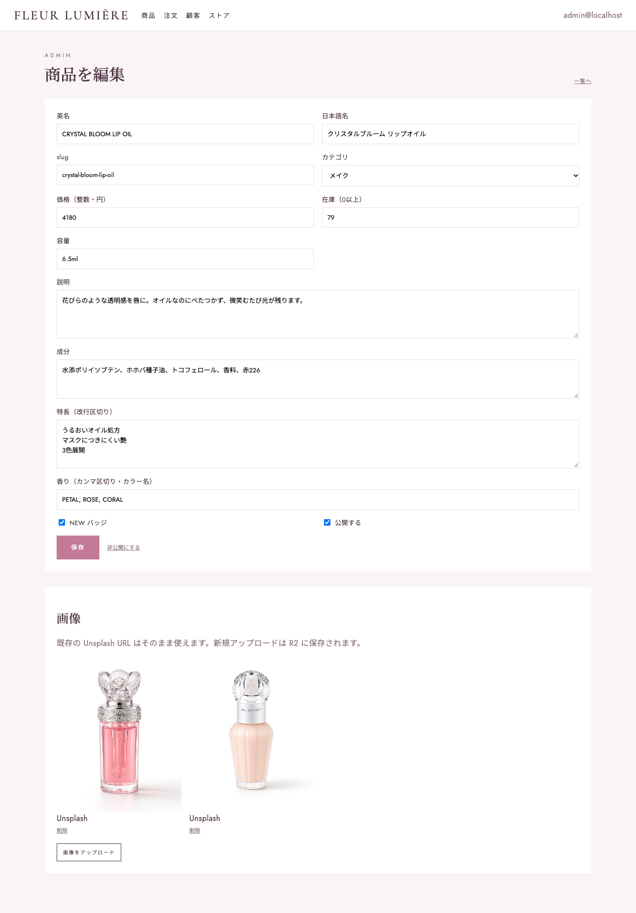
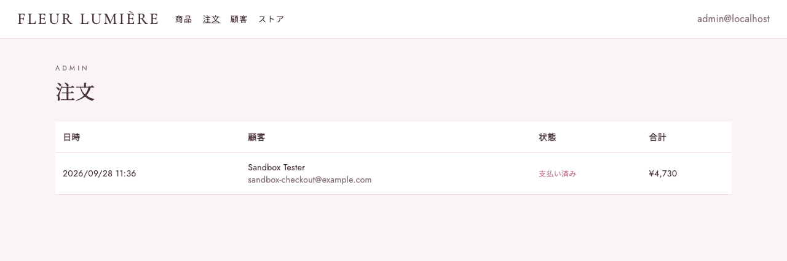
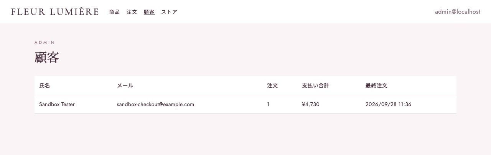

# FLEUR LUMIÈRE

ジルスチュアートのような、花と光をモチーフにした女性向けコスメのデモ EC。  
React + Cloudflare Workers / D1 / R2。カート〜決済の骨格は `EC`（Good Skin.）と同じです。

## 店頭







## 管理画面

`/admin`。本番は Cloudflare Access。









## ページ

店頭

- `/` トップ
- `/shop` 商品一覧
- `/products/:slug` 商品詳細
- `/about` ブランド
- `/checkout` 購入
- `/checkout/success` 完了

管理

- `/admin` 商品
- `/admin/orders` 注文
- `/admin/customers` 顧客

## 起動

```bash
npm install
npm run db:migrate:local
npm run dev
```

- ストア: [http://localhost:5173](http://localhost:5173)
- 管理: [http://localhost:5173/admin](http://localhost:5173/admin)

本番デプロイ前に D1 / R2 を作成し、`wrangler.jsonc` の ID を差し替えてください。

## 会員登録（Resend テスト）

確認メールは Resend のテスト送信（`onboarding@resend.dev`）です。任意のアドレスには届きません。登録後は画面の案内どおり、同じメールとパスワードでログインへ進んでください。

## Stripe（サンドボックス決済）

チェックアウトは Stripe Checkout のサンドボックスへリダイレクトします。テストカードは `4242 4242 4242 4242`（有効期限は未来、CVC は任意）です。本番キー（`sk_live_` / `rk_live_`）はサーバーが拒否します。

`.dev.vars` の `STRIPE_SECRET_KEY` にはサンドボックスの秘密キー（`sk_test_`、`rk_test_`、または Stripe CLI の `rkcs_test_`）を入れてください。CLI で作ったサンドボックスには期限があり、切れると決済開始時に「APIキーの期限が切れています」と出ます。そのときは `stripe login` で新しいサンドボックスを作り、出たテスト用シークレットキーで `.dev.vars` を更新して開発サーバーを再起動してください。

入金にする条件は、Webhook 署名が正しいことに加えて、通貨が JPY、金額と注文 ID が注文と一致し、`payment_status` が `paid` であることです。成功画面の確認も、ログイン中の注文者だけが実行できます。

```bash
npx wrangler secret put STRIPE_SECRET_KEY
npx wrangler secret put STRIPE_WEBHOOK_SECRET
```

Webhook の送信先は `/api/stripe/webhook` です。対象は `checkout.session.completed`、`checkout.session.async_payment_succeeded`、`checkout.session.async_payment_failed`、`checkout.session.expired` です。
